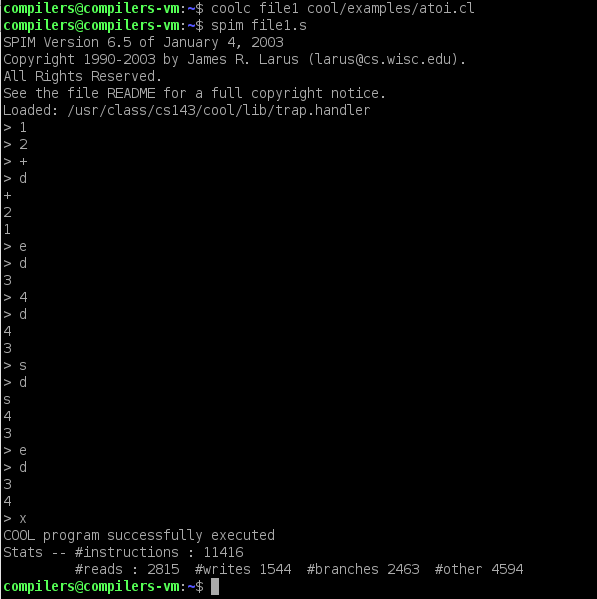

# First phase is just a simple programm in COOl just to get deep in the language and get to know it
## This code simulates a stack machine that has some certain instructions provided in the HomeWork description PDF File(asn1.pdf).
### Here's an example of the program:

